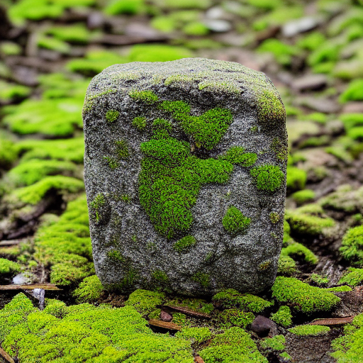

# Stable-Diffusion-Burn

Stable-Diffusion-Burn is a Rust-based project which ports the V1 stable diffusion model into the deep learning framework, Burn. This repository is licensed under the MIT Licence.

## How To Use

### Step 1: Download the Model and Set Environment Variables

Start by downloading the SDv1-4.bin model provided on HuggingFace.

```bash
wget https://huggingface.co/Gadersd/Stable-Diffusion-Burn/resolve/main/V1/SDv1-4.bin
```

Next, set the appropriate CUDA version.

```bash
export TORCH_CUDA_VERSION=cu113
```
### Step 2: Run the Sample Binary

Invoke the sample binary provided in the rust code, as shown below:

```bash
# Arguments: <model_type(burn or dump)> <model> <unconditional_guidance_scale> <n_diffusion_steps> <prompt> <output_image>
cargo run --release --bin sample burn SDv1-4 7.5 20 "An ancient mossy stone." img
```

This command will generate an image according to the provided prompt, which will be saved as 'img0.png'.



### Optional: Extract and Convert a Fine-Tuned Model

If users are interested in using a fine-tuned version of stable diffusion, the Python scripts provided in this project can be used to transform a weight dump into a Burn model file.

```bash
# Step into the Python directory
cd python

# Download the model, this is just the base v1.4 model as an example
wget https://huggingface.co/CompVis/stable-diffusion-v-1-4-original/resolve/main/sd-v1-4.ckpt

# Extract the weights
python3 dump.py sd-v1-4.ckpt

# Move the extracted weight folder out
mv params ..

# Step out of the Python directory
cd ..

# Convert the weights into a usable form
cargo run --release --bin convert params SDv1-4
```

The binaries 'convert' and 'sample' are contained in Rust. Convert works on CPU whereas sample needs CUDA.

Remember, `convert` should be used if you're planning on using the fine-tuned version of the stable diffusion. 

## License

This project is licensed under MIT license.

## Example Inference

INSER IMAGE HERE

We wish you a productive time using this project. Enjoy!